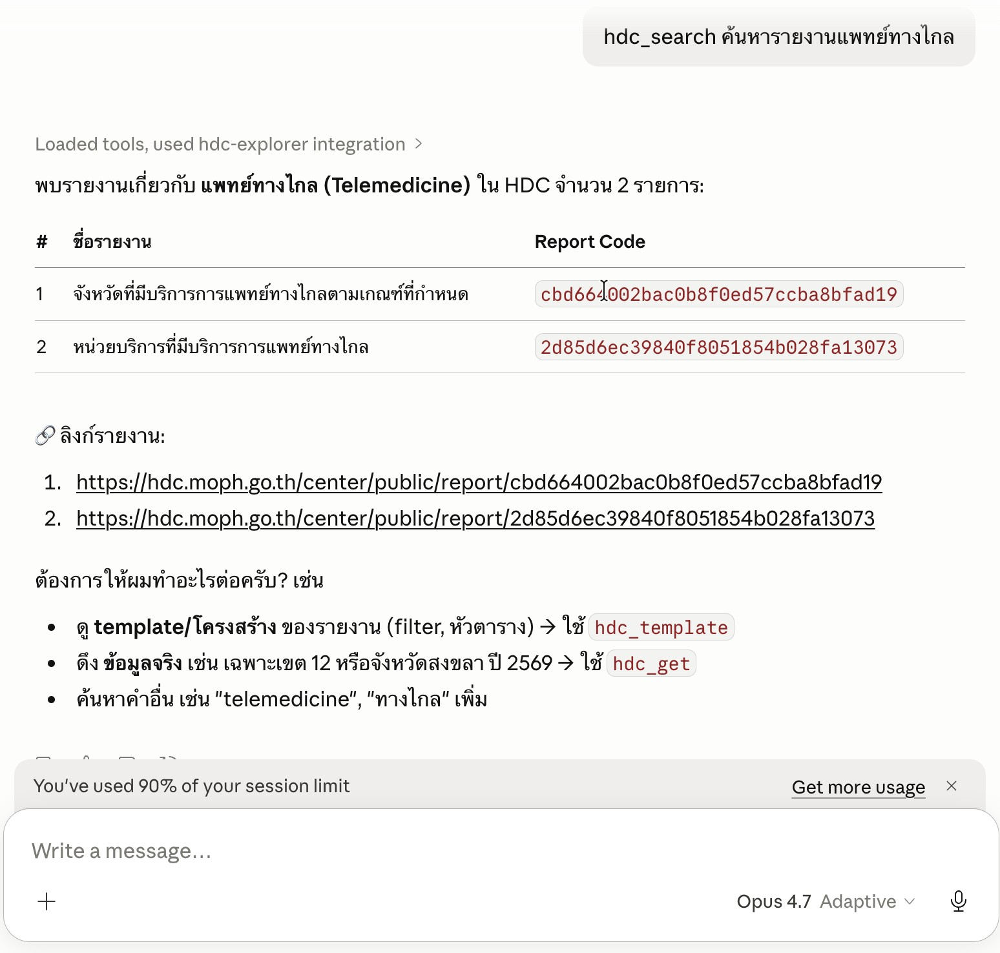
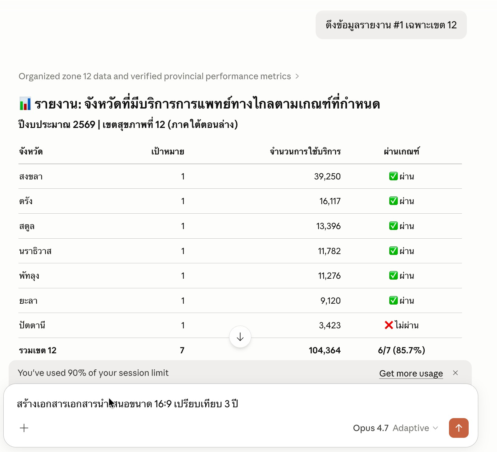

# HDC MCP Server

MCP Server สำหรับดึงข้อมูลจากระบบ [Health Data Center (HDC)](https://hdc.moph.go.th) กระทรวงสาธารณสุข รองรับการค้นหารายงาน ดึงข้อมูลพร้อมตัวกรองเขตสุขภาพ/จังหวัด และดูโครงสร้างรายงาน

> [!NOTE]
> This repository is provided as a preview version. While we offer it for experimental purposes, please be aware that it may not include complete functionality or comprehensive support.

## เครื่องมือ (Tools)

### `hdc_search` — ค้นหารายงาน

ค้นหารายงาน และ URL พร้อมใช้งาน

### `hdc_get` — ดึงข้อมูลรายงาน

ดึงข้อมูลรายงาน HDC พร้อมตัวกรองพื้นที่และปีงบประมาณ 

### `hdc_template` — ดูเอกสาร Template รายงาน

ดึงข้อมูล template ของรายงาน ทุกปีงบประมาณที่มีข้อมูล

### `hdc_areas` — รายชื่อพื้นที่

แสดงรายชื่อเขตสุขภาพ จังหวัด หรืออำเภอ

### `hdc_page` — ดึง Content หน้าเว็บ

ดึงข้อความและลิงก์จากหน้า HDC แบบ full-page เหมาะสำหรับหน้า Dashboard หรือ Summary ที่ไม่ใช่ตาราง

## ตัวอย่างการใช้งาน



## วิธีการติดตั้ง

### ข้อกำหนดเบื้องต้น

- [Node.js](https://nodejs.org/) v18 ขึ้นไป
- [npm](https://www.npmjs.com/) หรือ [yarn](https://yarnpkg.com/)
- [Claude Desktop](https://claude.ai/download) (สำหรับใช้งานผ่าน Claude)

### 1. Clone repository

```bash
git clone https://github.com/<your-username>/hdc-mcp-server.git
cd hdc-mcp-server
```

### 2. ติดตั้ง dependencies

```bash
npm install
```

> Puppeteer จะดาวน์โหลด Chromium อัตโนมัติระหว่างติดตั้ง (~200 MB)

### 3. Build

```bash
npm run build
```

ไฟล์ที่ build แล้วจะอยู่ที่ `build/index.js`

### 4. ตั้งค่า Claude Desktop

เปิดไฟล์ config ของ Claude Desktop:

| OS | Path |
|----|------|
| macOS | `~/Library/Application Support/Claude/claude_desktop_config.json` |
| Windows | `%APPDATA%\Claude\claude_desktop_config.json` |

เพิ่ม block ต่อไปนี้ใน `mcpServers`:

```json
{
  "mcpServers": {
    "hdc-explorer": {
      "command": "node",
      "args": [
        "/ABSOLUTE/PATH/TO/hdc-mcp-server/build/index.js"
      ]
    }
  }
}
```

> แทน `/ABSOLUTE/PATH/TO/` ด้วย path จริงของโปรเจกต์

### 5. Restart Claude Desktop

ปิดและเปิด Claude Desktop ใหม่ MCP server จะ active ทันที

---

## License

ISC
